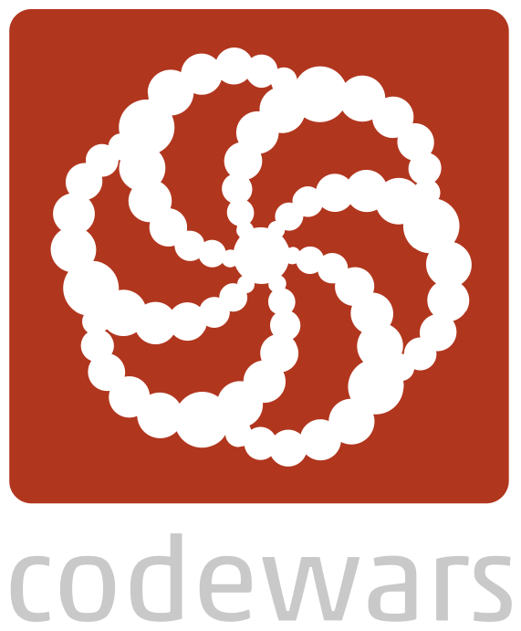

# codewars_training

In this repository, I will be sharing my trainings in Codewars, I will be posting codes in folders with date and name of the challenge, in addition of a brief description and link to the challenge.

### What is Codewars ?

Codewars is an online platform that proposes many coding challenges which can solved with many languages, the platform tests the code and verifies if the input/output are good.
It is used to learn or to train.

Link : https://codewars.com

### Which technologies will I be using 

   

In this repository, I will be using Javascript, Typescript, Python, C# and maybe other technologies.

### Will I only be using Codewars? 

Nope, I probably will be using Leetcode or Codingame too. 

